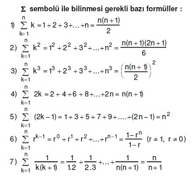

## algoritma analizi ders kodları - bahar 2020
---
### 2ⁿ grafiği (y=2^x):

---
### n grafiği (y=x):

---
### log(n) grafiği (y=log(x)):

---
### toplam formülleri:

---
kaynaklar:

- https://www.desmos.com/calculator
- https://matematiktutkusu.com/tags/Toplam+Sembol%C3%BC+form%C3%BClleri/